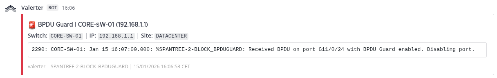
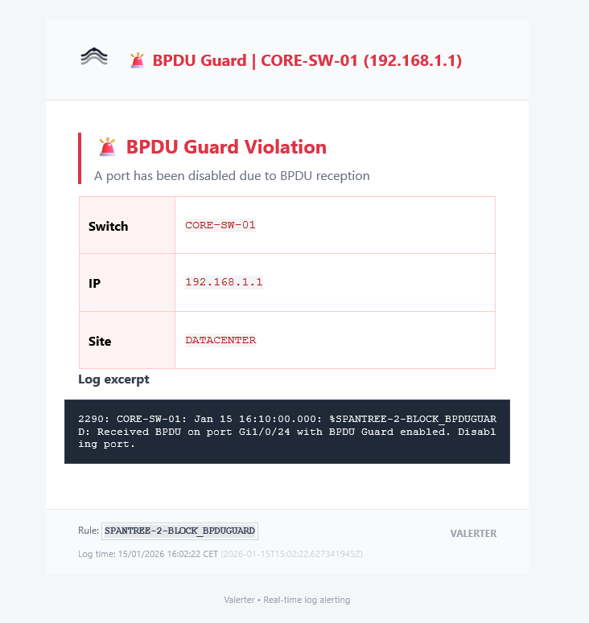

# Cisco Switches Alerting

Real-time alerts for Cisco IOS/IOS-XE switches. This example focuses on **STP BPDU Guard violations**, but the same pattern applies to any log source.

> **This is a reference implementation.** The mechanisms shown here (query filtering, field extraction, throttling, templating) work the same way for any log type: Linux syslogs, application logs, firewall events, etc.

## Log Flow

```
Cisco Switch (syslog)
       ↓
VictoriaLogs
       ↓
Valerter (streams & alerts)
       ↓
Mattermost / Email
```

## Sample Log

A BPDU Guard violation stored in VictoriaLogs:

```json
{
  "_time": "2026-01-15T16:10:00.000Z",
  "_msg": "2290: CORE-SW-01: Jan 15 16:10:00.000: %SPANTREE-2-BLOCK_BPDUGUARD: Received BPDU on port Gi1/0/24 with BPDU Guard enabled. Disabling port.",
  "hostname": "192.168.1.1",
  "site": "DATACENTER",
  "severity": "2",
  "level": "critical",
  "group": "SW"
}
```

## How Valerter Processes It

Each step below is a reusable building block. Adapt them to your own logs.

### 1. Query — Select Which Logs to Monitor

```yaml
query: 'group:"SW" "SPANTREE-2-BLOCK_BPDUGUARD"'
```

The query uses [LogsQL syntax](https://docs.victoriametrics.com/victorialogs/logsql/) to filter logs in real-time:

- `group:"SW"` — matches only logs with this field value
- `"SPANTREE-2-BLOCK_BPDUGUARD"` — full-text search in `_msg`

**Adapt it:** Change the filter to match your logs. Examples:
- `app:"nginx" "502 Bad Gateway"` — nginx errors
- `level:"error" service:"payment"` — payment service errors
- `_msg:~"failed.*authentication"` — regex match on message

### 2. Parser — Extract Fields from Logs

```yaml
parser:
  json:
    fields: ["hostname", "site", "severity", "_msg", "level"]
  regex: '^\d+: (?P<switch_name>[A-Z0-9-]+):'
```

Two extraction methods work together:

| Method | Purpose | Result |
|--------|---------|--------|
| **JSON** | Extract top-level fields from the log | `hostname`, `site`, `severity` become variables |
| **Regex** | Extract data embedded in `_msg` | Named group `(?P<switch_name>...)` creates `switch_name` variable |

**Adapt it:**
- If your logs are JSON, list the fields you need
- If you need to parse unstructured text, use regex with named capture groups `(?P<name>pattern)`
- You can use both together — JSON first, then regex on `_msg`

### 3. Throttle — Prevent Alert Spam

```yaml
throttle:
  key: "{{ switch_name }}"
  count: 3
  window: 5m
```

Throttling groups alerts and limits notifications:

| Setting | Effect |
|---------|--------|
| `key` | Groups alerts by this value (template syntax) |
| `count` | Maximum alerts per group per window |
| `window` | Time window before counter resets |

With the config above: **max 3 alerts per switch per 5 minutes**.

**Adapt it:**
- `key: "{{ hostname }}"` — throttle per host
- `key: "{{ error_code }}"` — throttle per error type
- `key: "{{ hostname }}-{{ service }}"` — throttle per host+service combo
- Remove `key` entirely — global throttle across all matching logs

### 4. Notify — Route to Destinations

```yaml
notify:
  template: "SPANTREE-2-BLOCK_BPDUGUARD"
  destinations:
    - mattermost-infra
    - email-infra
```

Each rule must specify:
- `template` — which template to use for formatting
- `destinations` — list of notifiers to send to (defined in `notifiers` section)

### 5. Template — Format the Notification

Templates use [Jinja2 syntax](https://jinja.palletsprojects.com/) with all extracted variables:

```yaml
templates:
  SPANTREE-2-BLOCK_BPDUGUARD:
    title: "🚨 BPDU Guard | {{ switch_name }} ({{ hostname }})"
    body: |
      **Switch:** `{{ switch_name }}` | **IP:** `{{ hostname }}` | **Site:** `{{ site }}`
      ```
      {{ _msg }}
      ```
    body_html: |
      <!-- HTML version for email -->
```

**Available variables:**
- All JSON fields extracted by parser
- All regex named groups
- `_msg` — original log message
- `rule_name` — name of the triggered rule
- `log_timestamp_formatted` — human-readable timestamp

## Result

**Mattermost:**

<p align="center">
  
</p>

**Email:**

<p align="center">
  
</p>

## Other Cisco Alerts

Just change the query to monitor different events:

| Alert Type | Query |
|------------|-------|
| Hardware warnings | `group:"SW" "PLATFORM-4-ELEMENT_WARNING"` |
| SFP threshold | `group:"SW" "SFF8472-3-THRESHOLD_VIOLATION"` |
| VLAN mismatch | `group:"SW" "CDP-4-NATIVE_VLAN_MISMATCH"` |
| Stack link change | `group:"SW" "STACKMGR-4-STACK_LINK_CHANGE"` |
| Switch restart | `group:"SW" "SYS-5-RESTART"` |
| All critical (0-2) | `group:"SW" severity:~"[0-2]"` |

## Full Configuration

See [config.yaml](config.yaml) for the complete working configuration.
